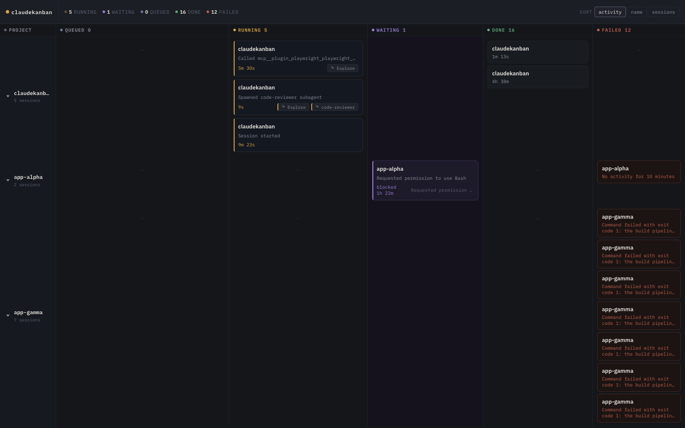
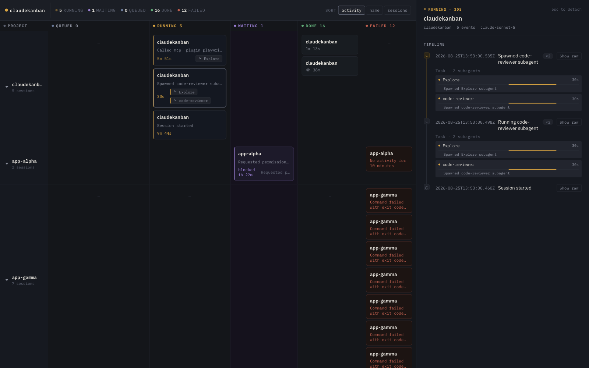

# claudekanban

A real-time kanban-style console for observing Claude Code sessions. Claude
Code hooks forward hook payloads to a local Express backend, which persists
them to SQLite and pushes live updates to a React board over SSE.

## Screenshots

**Board** — one swimlane per project, crossed with status columns
(`queued`/`running`/`waiting`/`done`/`failed`). A `FleetBar` strip up top
shows live counts across every project. Running cards show a title, elapsed
timer, and chips for any subagents they've spawned.



**Detail view** — click any card to open its timeline: every hook event for
that session, with subagent spawns nested under the `Task` call that started
them, live progress bars for subagents still running, and a raw-JSON toggle
per entry.



## How it works

```
Claude Code hook event → hooks/on-*.sh (curl POST to /ingest)
  → backend ingest/domain synthesis → SQLite
  → SSE broadcast → React board (live update)
```

## Example: watch a session end to end

1. Install the hooks (see [Setup](#setup) below), then start the backend and
   frontend.
2. Start a normal Claude Code session in any project. The moment its
   `SessionStart` hook fires, a card appears in that project's swimlane under
   `running`, with a live elapsed timer.
3. If that session spawns a subagent (e.g. via the `Task` tool), a small chip
   for it appears on the parent's card — click the chip to jump straight to
   the subagent's own row in the parent's timeline.
4. If Claude Code stops to ask for a permission decision, the card moves to
   `waiting` with a "blocked" timer, so it's visible at a glance which
   sessions need a human.
5. When the session ends, the card moves to `done` (with a one-line recap) or
   `failed` (with the failure reason) — no polling, no refresh, pushed over
   SSE the instant the `Stop` hook fires.
6. Click the card at any point to open the detail panel and see the full
   event timeline behind that summary.

## Setup

```bash
npm install
npm run dev:server    # backend, http://localhost:4317 (CLAUDEKANBAN_PORT)
npm run dev:frontend  # Vite dev server for the board UI
```

To actually see data, wire the scripts in `hooks/` into a Claude Code
`settings.json` (project or user-level) so hook events get forwarded to the
backend:

```bash
npm run hooks:install            # prompts for user-level vs. project-level
npm run hooks:install -- --user  # or --project, non-interactively
npm run hooks:install -- --path <file>  # target a specific settings.json
npm run hooks:install -- --dry-run   # preview without writing
npm run hooks:install -- --remove    # cleanly uninstall
npm run hooks:install -- --yes       # skip the confirm prompt (needed if stdin isn't a TTY)
```

This merges the 8 claudekanban hook entries into the target `settings.json`
without touching any other hooks already registered there, backing up the
file to `settings.json.bak` before writing.

## VSCode extension

As an alternative to running `dev:server`/`dev:frontend` by hand, the board
can run inside VSCode: the extension spawns the same backend as a child
process (a "Managed server," one per workspace, on an OS-assigned port) and
renders the same React board in a Webview panel, right next to your code.
The Standalone flow above is unaffected either way — both share the same
codebase, just different lifecycles (see
[`docs/adr/0002-vscode-extension-spawns-standalone-server.md`](docs/adr/0002-vscode-extension-spawns-standalone-server.md)).

To try it: open this repo in VSCode, then press F5 (Run and Debug → "Run
ClaudeKanban Extension") to launch an Extension Development Host window. In
that window, open any folder and run these commands from the Command
Palette:

| Command | Purpose |
|---|---|
| `ClaudeKanban: Open Board` | Starts the Managed server for the open workspace (if not already running) and opens the board in a Webview panel |
| `ClaudeKanban: Install Hooks` | Merges the claudekanban hooks into that workspace's `.claude/settings.json` |

The extension is not yet packaged/published — it's meant to be run from
source via the Extension Development Host, not installed from a `.vsix`.

## Commands

| Command | Purpose |
|---|---|
| `npm run dev:server` | Run the backend (tsx watch) |
| `npm run dev:frontend` | Run the Vite dev server for the board UI |
| `npm run build` | Typecheck (`tsc -p tsconfig.json`) then `vite build` |
| `npm test` | Run the full vitest suite once |
| `npm run test:watch` | Vitest in watch mode |
| `npx vitest run <file>` | Run a single test file |
| `npx vitest run -t "<name>"` | Run a single test by name |
| `bash hooks/hooks.test.sh` | Hook smoke test — spins up a mock server on port 4317 and verifies every script in `hooks/` forwards stdin correctly |
| `npm run package:extension` | Builds the standalone app, the compiled server, and the VSCode extension (`build` + `build:server` + `build:extension`) |

## Architecture

Sessions and their subagents are tracked in a single SQLite table with two
lifecycles (top-level session vs. nested subagent), synthesized from hook
payloads by pure domain functions and pushed to the frontend over SSE. The
board groups sessions into a swimlane per project (`cwd`) crossed with
status columns; clicking a card opens its detail panel (`AttachPane`), built
from the same raw events as the board summary. See [`CLAUDE.md`](./CLAUDE.md)
for the full data-flow and domain-model breakdown, and
`docs/superpowers/specs/2026-08-07-operations-console-design.md` for the
living design spec.

## Status

Active, spike-driven development — see `docs/superpowers/` for the
brainstorm → spec → grilling → plan → execution workflow this project
follows, and `spike/findings.md` for confirmed Claude Code hook payload
behavior. Not a polished 1.0.
